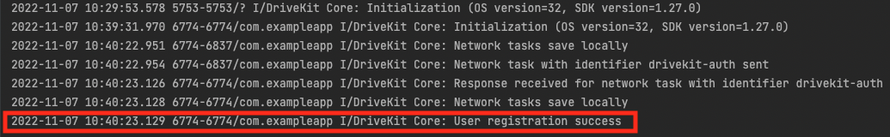
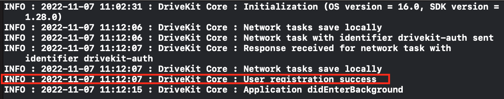

# @react-native-drivekit/core

React Native interface for DriveKit Core

## Installation

Install the library:

```sh
npm install @react-native-drivekit/core
```

Install iOS pods:

```sh
cd ios && pod install
```

---

## Initialization

### Android setup

Add DriveQuant Maven repository in your `build.gradle`.

```gradle
allprojects {
    repositories {
        maven {
            url "https://maven.drivequant.com/repository/android-sdk/"
        }
    }
}
```

Call `initialize` method inside your `MainApplication.java`.

```java
// MainApplication.java
import com.reactnativedrivekitcore.DriveKitCoreModule;

// ...

  @Override
  public void onCreate() {
    super.onCreate();
    DriveKitCoreModule.Companion.initialize(this);
    // ...
  }
```

---

### iOS setup

Call `initialize` method in your `AppDelegate.mm`.

```objc
// AppDelegate.mm
#import <RNDriveKitCore/react-native-drivekit-core-umbrella.h>

// ...

- (BOOL)application:(UIApplication *)application didFinishLaunchingWithOptions:(NSDictionary *)launchOptions
{
  [RNDriveKitCoreWrapper.shared initialize];
  ...
}
```

**Note:** If you are using Swift, `initialize` method is also available.

#### Bluetooth authorization

Even if your app do not use Bluetooth, you **MUST** include usage description on iOS side. For more details, please take a look inside the [native documentation](https://docs.drivequant.com/get-started-drivekit/ios#project-configuration)

Our recommandation is to use [react-native-permissions](https://github.com/zoontek/react-native-permissions). You can find an implementation example in the [example application inside this repository](../../example/App.tsx).

---

### Common

To finish the module's initialization, you need to :

1. Specify your API key;
2. Identify the driver with a unique ID.

#### Specify your API key

```typescript
setApiKey(key: string): Promise<void>
```

#### Specify your user ID

```typescript
setUserId(userId: string): Promise<void>
```

---

### Validation

To validate that the initialization has been done successfully, please check your native logs and verify that you can see the following success message.

**Android**


**iOS**


---

## Listeners

You can listen to events thanks to the `addEventListener` api.

```typescript
useEffect(() => {
  const listener = DriveKit.addEventListener(
    'driveKitDidReceiveAuthenticationError',
    (error: RequestError) => {
      console.log('Received authentication error from DriveKit', error);
    }
  );
  return () => listener.remove();
});
```

Here is the list of supported events:

- `driveKitConnected`, callback `() => void`: This event is triggered when the user has been successfully logged.
- `driveKitDisconnected`, callback `() => void`: This event is triggered when the user has been disconnected.
- `driveKitDidReceiveAuthenticationError`, callback `(requestError: RequestError) => void`: This event is triggered when The login has failed due to a `RequestError`.
- `accountDeletionCompleted`, callback `(status: DeleteAccountStatus)`: This event is triggered when the delete account request has been processed with a `DeleteAccountStatus` state value.
- `userIdUpdateStatusChanged`, callback `(status: UpdateUserIdStatus, userId: String?) => void`: This event is triggered when the update userId request has been processed with a `UpdateUserIdStatus` state value.

## API

| Method                                          | Return Type                        | iOS | Android |
| ----------------------------------------------- | ---------------------------------- | :-: | :-----: |
| [getApiKey()](#getapikey)                       | `Promise<string>`                  | ✅  |   ✅    |
| [setApiKey()](#setapikey)                       | `Promise<void>`                    | ✅  |   ✅    |
| [getUserId()](#getuserid)                       | `Promise<string>`                  | ✅  |   ✅    |
| [setUserId()](#setuserid)                       | `Promise<void>`                    | ✅  |   ✅    |
| [updateUserId()](#updateuserid)                 | `Promise<void>`                    | ✅  |   ✅    |
| [deleteAccount()](#deleteaccount)               | `Promise<void>`                    | ✅  |   ✅    |
| [reset()](#reset)                               | `Promise<void>`                    | ✅  |   ✅    |
| [enableLogging()](#logging)                     | `Promise<void>`                    | ✅  |   ✅    |
| [disableLogging()](#logging)                    | `Promise<void>`                    | ✅  |   ✅    |
| [getUriLogFile()](#getUriLogFile)               | `Promise<{ uri: string } \| null>` | ✅  |   ✅    |
| [composeDiagnosisMail()](#composediagnosismail) | `Promise<void>`                    | ✅  |   ✅    |
| [isTokenValid()](#istokenvalid)                 | `Promise<boolean>`                 | ✅  |   ✅    |
| [getUserInfo()](#getuserinfo)                   | `Promise<UserInfo \| null>`        | ✅  |   ✅    |
| [updateUserInfo()](#updateuserinfo)             | `Promise<void>`                    | ✅  |   ✅    |

### getApiKey

```typescript
getApiKey(): Promise<string>
```

This method can be useful to check which DriveKit API Key you have set in the SDK.

```typescript
const apiKey = await getApiKey();
```

### setApiKey

```typescript
setApiKey(key: string): Promise<void>
```

To use DriveKit modules, you have to obtain an API Key from DriveQuant. If you don't have an API key, please contact [DriveQuant](mailto:contact@drivequant.com).

Once you've stored your API key in a secure way in your application, you can configure DriveKit by calling the following method:

```typescript
setApiKey('MyAPIKey');
```

### getUserId

```typescript
getUserId(): Promise<string>
```

This method can be useful to retrieve the current userId.

```typescript
const userId = await getUserId();
```

### setUserId

```typescript
setUserId(userId: string): Promise<void>
```

Each driver must be identified with a unique identifier. Once you have this identifier, configure DriveKit by calling the following method:

```typescript
setUserId('MyUserId');
```

> ℹ️
>
> You can call these 2 configuration methods anywhere in the code. DriveKit will save the value locally. If the app is killed and relaunched, DriveKit will be reconfigured automatically.

> ⚠️
>
> We recommend never using an email address or phone number to define the unique user ID. It is recommended that you set up a unique, universal and anonymous user ID. For example, you can generate a globally unique identifier (GUID) for each of your users.

> ⚠️
>
> DriveKit SDK will not work until you set the API key and the userId.

### updateUserId

```typescript
updateUserId(userId: string): Promise<void>
```

It is possible to update the userId by calling the following method:

```typescript
updateUserId('newUserId');
```

### deleteAccount

```typescript
deleteAccount(instantDeletion?: boolean): Promise<void>
```

You can delete a driver's account in DriveKit. This action deletes all the data related to the account.

The deletion can be done instantly or with delay.

- In the first case, when the method is called, the account is instantly deleted.
- In the second case, the driver has 30 days to log back into the application and reactivate his account.

To delete a driver's account, use the following method:

```typescript
deleteAccount(false);
```

instantDeletion can have 2 values:

- `false` : **Default value**, allows the user to recover the deleted account by logging-in again with the same credentials. Users have 30 days starting from the day when the account was deleted.
- `true` : Allows to delete an account instantly. The account and all the related data will be immediately deleted and no rollback is possible.

> ℹ️
>
> Your team needs to have the deletion feature activated to use this method. Please contact DriveQuant if you need it.

> ℹ️
>
> To be able to check whenever the account deletion is complete, you have to use the DriveKitDelegate interface.

> ⚠️
>
> You should restore the DriveKit API key in the onAccountDeleted() callback only when the status value is SUCCESS.

### reset

```typescript
reset(): Promise<void>
```

If you need to reset DriveKit configuration (user logout for example), you can call the following method:

```typescript
reset();
```

All data saved locally by DriveKit will be erased.

> ℹ️
>
> All DriverKit frameworks have reset method that erases all data saved locally by the framework.

> ⚠️
>
> Make sure that you call reset method of all frameworks to fully reset DriveKit configuration.

### Logging

```typescript
  enableLogging(options?: { logPath?: string; showInConsole?: boolean }): Promise<void>;

  disableLogging(options?: { showInConsole?: boolean }): Promise<void>;
```

| Option                    | Default Value | Description                                                             |
| ------------------------- | ------------- | ----------------------------------------------------------------------- |
| `showInConsole?: boolean` | `true`        | set to false if you don't want your logs to be displayed in the console |
| `logPath?: string`        | `"/DriveKit"` | **android only** - path where the log files will be saved               |

DriveKit comes with a logging feature that is enabled by default. This feature allows you to quickly identify the cause of a problem. We recommend leaving the log enabled as it does not consume memory space and is useful in the support phase. However, if you don't want to use it, it can be disabled.

> ⚠️ **Android**
>
> If your device version is on Android 10 or below, you can directly find the log file in Android/data/<your-app-package-name>/files/<path-to-my-log-directory>
> If your device version is on Android 11 and if you have The Permissions Utils component on your app, you can get a log file of the previous month and the current one with the method getZippedLogUriFiles(), or by clicking on “Contact support” and change the email receiver. The file will be in attachment of the email.

> ℹ️ **iOS**
>
> Log will be written in app directory. One log file per month will be written with the name log-\<YEAR\>-\<MONTH\>.txt (example: `log-2019-8.txt`). All DriveKit modules log in this file.
>
> You can make files of your application (including DriveKit log files) available in the iOS Files app by adding these 2 keys to your project's Info.plist file: UIFileSharingEnabled and LSSupportsOpeningDocumentsInPlace, setting them both to true.

> ⚠️ **iOS**
>
> To write log files on user smartphone, you must add the following entry in your info.plist file `UIFileSharingEnabled` and `LSSupportsOpeningDocumentsInPlace` set to true.

Disable logging by calling:

```typescript
disableLogging();
```

To enable logging, call the following method specifying the path of the log directory.

```typescript
enableLogging({ logPath: '/path/to/my/log/directory' });
```

### isTokenValid

```typescript
  isTokenValid(): Promise<boolean>
```

Once you are connected to the SDK with your key and a user ID, you can check the validity of the generated token by calling:

```typescript
const isValid = await isTokenValid();
```

### getUserInfo

```typescript
getUserInfo(
  synchronizationType: 'default' | 'cache' = 'default'
): Promise<UserInfo | null>
```

| UserInfo    | Type             |
| ----------- | ---------------- |
| `firstname` | `string \| null` |
| `lastname`  | `string \| null` |
| `pseudo`    | `string \| null` |

To get user’s information (first name, last name and pseudo), call the getUserInfo method. It will retrieve and save these data locally:

```typescript
const userInfo = await getUserInfo();
```

### updateUserInfo

```typescript
updateUserInfo(
  userInfo: UserInfo
): Promise<void>
```

| UserInfo    | Type             |
| ----------- | ---------------- |
| `firstname` | `string \| null` |
| `lastname`  | `string \| null` |
| `pseudo`    | `string \| null` |

You can add information to a user's account such as first name, last name and pseudo. These details are optional and you can choose to make the user's account anonymous. To update the user's information, you must call the updateUserInfo method:

```typescript
await updateUserInfo({
  firstname: 'firstname',
  lastname: 'lastname',
  pseudo: 'pseudo',
});
```

### getUriLogFile

```typescript
  getUriLogFile(): Promise<{ uri: string } | null>;
```

You can retrieve the Uri log file by calling the following method:

```typescript
const { uri } = await getUriLogFile();
```

### composeDiagnosisMail

```typescript
  composeDiagnosisMail(): Promise<void>
```

You can compose a diagnosis mail with attached DriveKit logs (if available). To do this, call this following method:

```typescript
DriveKit.composeDiagnosisMail({
  recipients: [],
  bccRecipients: [],
  subject: 'Diagnosis mail',
  body: '',
});
```
