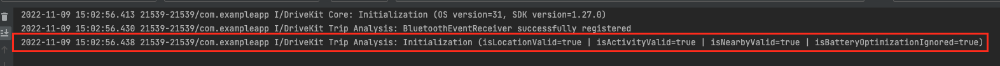
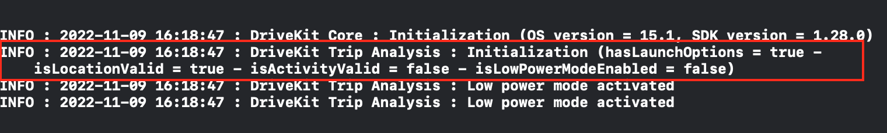

# @react-native-drivekit/trip-analysis

React Native interface for DriveKit Trip Analysis

## Prerequisite

Before installing `@react-native-drivekit/trip-analysis` **you must have installed** `@react-native-drivekit/core`, especially if you have disabled the DriveKit auto-initialization.

---

## Installation

Install the library:

```sh
npm install @react-native-drivekit/trip-analysis
```

Install iOS pods:

```sh
cd ios && pod install
```

---

## Initialization

### Android setup

If you have disabled the DriveKit auto-initialization, call `initialize` method in the `onCreate()` method of your Application class.

```java
// MainApplication.java
import com.reactnativedrivekitcore.DriveKitCoreModule;
import com.reactnativedrivekittripanalysis.DriveKitTripAnalysisModule;

// ...
  @Override
  public void onCreate() {
    super.onCreate();
    DriveKitCoreModule.Companion.initialize(this);

    // ADD THESE LINES
    final RNTripNotification tripNotification = new RNTripNotification(123, "DriveKit SDK", "Start a trip with DriveKit SDK", R.drawable.ic_notification)
    final RNHeadlessJSNotification headlessJSNotification = new RNHeadlessJSNotification("DriveKit SDK", "Loading in progress…");
    DriveKitTripAnalysisModule.Companion.initialize(tripNotification, headlessJSNotification);
    ...
  }
```

> ℹ️
>
> The properties in `RNTripNotification` are used to configure the notification displayed when a trip is recording.
>
> The properties in `RNHeadlessJSNotification` are used to configure the notification when the `HeadlessJS` service is running

If the DriveKit auto-initialization is enabled, you have to

- configure the trip notification content displayed during a trip analysis by calling the following method:

```kotlin
val tripNotification = RNTripNotification(123, "DriveKit SDK", "Start a trip with DriveKit SDK", R.drawable.ic_notification)
DriveKitTripAnalysisModule.Companion.configureTripNotification(tripNotification);
```

- configure the HeadlessJS notification content by calling the following method:

```kotlin
val headlessJSNotification: RNHeadlessJSNotification = RNHeadlessJSNotification("DriveKit SDK", "Loading in progress…")
DriveKitTripAnalysisModule.Companion.configureHeadlessJSNotification(headlessJSNotification)
```

#### Authorization

In order to collect data, you need to configure multiple permissions :

- Location permission: [native documentation](https://docs.drivequant.com/trip-analysis/android/get-started#location-permission)
- Activity recogniton permission: [native documentation](https://docs.drivequant.com/trip-analysis/android/get-started#activity-recognition-permission)
- Nearby device permission: [native documentation](https://docs.drivequant.com/trip-analysis/android/get-started#nearby-devices-permission)
- Notification runtime permission: [native documentation](https://docs.drivequant.com/trip-analysis/android/get-started#notification-runtime-permission)

Our recommandation is to use [react-native-permissions](https://github.com/zoontek/react-native-permissions). You can find an implementation example in the [demo application inside this repository](../demo/App.tsx).

#### Battery optimization

In order to make Trip Analysis SDK to work properly, you need to disable battery optimization for your app: [native documentation](https://docs.drivequant.com/trip-analysis/android/get-started#battery-optimization)

Our recommandation is to use [react-native-battery-optimization-check](https://github.com/losthakkun/react-native-battery-optimization-check).You can find an implementation example in the [demo application inside this repository](../demo/App.tsx).

**IMPORTANT**

This library is not actively maintained. The problem is that the method that call the native modal is not promisified. It means that we can't wait for the user answer before continuing. At the moment, our recommandation is to check this permission at the end of your flow.
On our side, we are working on implementing a better solution.

This is the better solution we found. If you find a better solution, please feel free to open an issue/PR in this repository.

---

### iOS setup

If you have disabled the DriveKit auto-initialization,, call `initialize` method in your `AppDelegate.mm`.

```objc
// AppDelegate.mm
#import <RNDriveKitTripAnalysis/react-native-drivekit-trip-analysis-umbrella.h>

// ...

- (BOOL)application:(UIApplication *)application didFinishLaunchingWithOptions:(NSDictionary *)launchOptions
{
  [[RNDriveKitCoreWrapper.shared initialize];
  [RNDriveKitTripAnalysisWrapper.shared initializeWithLaunchOptions:launchOptions]; // ADD THIS LINE
  ...
}
```

**Note:** If you are using Swift, `initialize` method is also available.

#### Configure capabilities

You need to turn on Background Modes & enable Location updates. For more details please follow the [iOS documentation](https://docs.drivequant.com/trip-analysis/ios/get-started#configure-capabilities)

#### Authorization

In order to collect data, you need to configure multiple permissions :

- Location permission : [native documentation](https://docs.drivequant.com/trip-analysis/ios/get-started#ask-for-location-permission)
- Motion permission : [native documentation](https://docs.drivequant.com/trip-analysis/ios/get-started#motion-and-fitness-permission)

Our recommandation is to use [react-native-permissions](https://github.com/zoontek/react-native-permissions). You can find an implementation example in the [demo application inside this repository](../demo/App.tsx).
For location permission, please use [requestIOSLocationPermission()](https://github.com/DriveQuantPublic/react-native-drivekit/blob/main/packages/core/README.md#requestIOSLocationPermission) method for iOS.

When the application requests permission for background locations or motion activities, a message will be shown to the user. You must configure this message by changing the value for the following keys in `Info.plist`

- `NSLocationWhenInUseUsageDescription`
- `NSLocationAlwaysAndWhenInUseUsageDescription`
- `NSMotionUsageDescription`

[Our Demo App plist file contains an example of messages you can use for these permissions](https://github.com/DriveQuantPublic/react-native-drivekit/blob/main/packages/demo/ios/DriveKitRNDemoApp/Info.plist#L42)

### Validation

To validate that the initialization has been done successfully, please check your native logs and verify that you can see the following success message.

**Android**


**iOS**


## Listeners

**Note:** These listeners will not be triggered on Android when the app is in background, due to system limitation. Please read the [Headless JS](#headless-js-android-only) part.

You can listen to events thanks to the `addEventListener` api.

```typescript
useEffect(() => {
  const listener = DriveKitTripAnalysis.addEventListener(
    'tripStarted',
    (startMode: StartMode) => {
      console.log('trip start', startMode);
    }
  );
  return () => listener.remove();
});
```

Here is the list of supported events:

- `tripRecordingStarted`, callback `(state: DKTripRecordingStartedState) => void`: Immediately called when a trip recording starts. This callback is triggered after calling the DriveKit SDK's `startTrip()` method or after automatic trip detection. `DKTripRecordingStartedState` object is described [here](https://docs.drivequant.com/trip-analysis/ios/references#dktriprecordingstartedstate).
- `tripRecordingConfirmed`, callback `(state: DKTripRecordingConfirmedState) => void`: Called when a trip is confirmed. `DKTripRecordingConfirmedState` object is described [here](https://docs.drivequant.com/trip-analysis/ios/references#dktriprecordingconfirmedstate).
- `tripRecordingCanceled`, callback `(state: DKTripRecordingCanceledState) => void`: Called when a trip recording is canceled. `DKTripRecordingCanceledState` indicates which event has canceled the trip. `DKTripRecordingCanceledState` object is described [here](https://docs.drivequant.com/trip-analysis/ios/references#dktriprecordingcanceledstate).
- `tripRecordingFinished`, callback `(state: DKTripRecordingFinishedState) => void`: Called when trip recording has ended, before sending trip data to DriveQuant's servers. `DKTripRecordingFinishedState` object is described [here](https://docs.drivequant.com/trip-analysis/ios/references#dktriprecordingfinishedstate).
- `tripFinishedWithResult`, callback `(result: TripResult) => void`: Called when a trip has been recorded by the SDK and sent to DriveQuant's server to be analyzed. `TripResult` object contains trip response status details. Read more [here](https://docs.drivequant.com/trip-analysis/ios/references#tripresponsestatus).
- `tripPoint`, callback `(tripPoint: TripPoint) => void`: This event is triggered when a trip is started and confirmed, for each GPS point recorded by the SDK.
- `tripSavedForRepost`, callback `() => void`: This event is triggered if at the end of the trip, the trip can be sent to DriveQuant's server for the analysis. The trip is saved locally on the SDK and will be sent later.
- `beaconDetected`, callback `() => void`: This event is triggered when a beacon sets in the SDK is detected.
- `significantLocationChangeDetected`, callback `() => void`: This event is triggered when a user significant location change is detected. (only for iOS)
- `sdkStateChanged`, callback `(state: State) => void`: This event is triggered every time the state of the SDK changed with the new state as parameter.
- `crashDetected`, callback `(info: CrashInfo) => void`: This event is triggered when crash detection feature is enabled and available for your team and when a crash has been detected.
- `crashFeedbackSent`, callback `(crashFeedback: CrashFeedback) => void`: Event triggered when crash feedback is enabled and a confirmed crash is detected. This callback will contain crash information and the feedback from the user.
- `tripStarted (deprecated)`, callback `(startMode: StartMode) => void`: Use the callback `tripRecordingConfirmed()` instead. This event is triggered each time a trip is started. StartMode indicates which event starts the trip.
- `tripCancelled (deprecated)`, callback `(cancelTrip: CancelTrip) => void`: Use the callback `tripRecordingCanceled()` instead. This event is triggered when a trip is canceleed. CancelTrip indicates which event cancels the trip.
- `tripFinished (deprecated)`, callback `(post: PostGeneric, response: PostGenericResponse)`: Use the callback `tripFinishedWithResult()` instead. This event is triggered when a trip has been recorded by the SDK and sent to DriveQuant's server to be analyzed. PostGeneric object contains raw data sent to DriveQuant's server, PostGenericResponse object contains the trip analysis made on DriveQuant's server.

## Headless JS (Android only)

To display a notification when the trip is finished or canceled for example, it is not possible to handle listeners like the iOS platform, because listeners are not triggered when the device is locked or the app is not in foreground. To manage that limitation, a Headless JS service has been introduced on Trip Analysis component.

Follow these steps :

- Register the Headless task named `DKHeadlessJS` on your `index.js` file.
- Replicate the `DKHeadlessJS.js` file that exists on the demo package.

## API

| Method                                                                              | Return Type                              | iOS | Android |
| ----------------------------------------------------------------------------------- | ---------------------------------------- | :-: | :-----: |
| [activateAutoStart()](#activateautostart)                                           | `Promise<void>`                          | ✅  |   ✅    |
| [startTrip()](#starttrip)                                                           | `Promise<void>`                          | ✅  |   ✅    |
| [stopTrip()](#stoptrip)                                                             | `Promise<void>`                          | ✅  |   ✅    |
| [cancelTrip()](#canceltrip)                                                         | `Promise<void>`                          | ✅  |   ✅    |
| [isTripRunning()](#istriprunning)                                                   | `Promise<boolean>`                       | ✅  |   ✅    |
| [activateCrashDetection()](#activatecrashdetection)                                 | `Promise<void>`                          | ✅  |   ✅    |
| [enableMonitorPotentialTripStart()](#enablemonitorpotentialtripstart)               | `Promise<void>`                          | ✅  |   ✅    |
| [setStopTimeout()](#setStopTimeout)                                                 | `Promise<void>`                          | ✅  |   ✅    |
| [getTripMetadata()](#getTripMetadata)                                               | `Promise<TripMetadata \| null>`          | ✅  |   ✅    |
| [setTripMetadata(metadata: TripMetadata)](#setTripMetadata)                         | `Promise<void>`                          | ✅  |   ✅    |
| [deleteTripMetadata(string?: string)](#deleteTripMetadata)                          | `Promise<void>`                          | ✅  |   ✅    |
| [updateTripMetadata(key: string, value: string)](#updateTripMetadata)               | `Promise<void>`                          | ✅  |   ✅    |
| [setVehicle()](#setvehicle)                                                         | `Promise<void>`                          | ✅  |   ✅    |
| [getCurrentTripInfo()](#getCurrentTripInfo)                                         | `Promise<CurrentTripInfo \| null>`       | ✅  |   ✅    |
| [getLastTripLocation()](#getLastTripLocation)                                       | `Promise<LastTripLocation \| null>`      | ✅  |   ✅    |
| [isTripSharingAvailable()](#isTripSharingAvailable)                                 | `Promise<boolean>`                       | ✅  |   ✅    |
| [createTripSharingLink(durationInSec: number)](#createTripSharingLink)              | `Promise<CreateTripSharingLinkResponse>` | ✅  |   ✅    |
| [getTripSharingLink(synchronizationType: SynchronizationType)](#getTripSharingLink) | `Promise<GetTripSharingLinkResponse>`    | ✅  |   ✅    |
| [revokeTripSharingLink()](#revokeTripSharingLink)                                   | `Promise<RevokeTripSharingLinkStatus>`   | ✅  |   ✅    |

### activateAutoStart

```typescript
activateAutoStart(enable: boolean): Promise<void>
```

The automatic mode detects vehicle movements and triggers the trip analysis without driver intervention while the application is in background. The analysis is stopped automatically at the end of the trip.

This feature is recommended to avoid driver distraction and phone handling while driving. The automatic mode has been optimized to limit the battery drain.

To enable automatic trip detection mode, call the following method:

```typescript
activateAutoStart(true);
```

To disable automatic trip detection call the same method with parameter enable set to false

```typescript
activateAutoStart(false);
```

> ⚠️
>
> If a trip is running when automatic trip detection is disabled, the trip will not be canceled. If you want to cancel the trip, you should also call cancelTrip method.

### startTrip

```typescript
startTrip(): Promise<void>
```

You can start a trip by calling the following method:

```typescript
startTrip();
```

> ℹ️
>
> If a trip's already started, calling this method will have no effect.

### stopTrip

```typescript
stopTrip(): Promise<void>
```

You can stop a trip by calling the following method. The trip will be stopped instantly:

```typescript
stopTrip();
```

> ℹ️
>
> If a vehicle stops longer than the [timeout configured](https://docs.drivequant.com/trip-analysis/ios/advanced-configuration#custom-stop-timeout), the trip will be stopped automatically.

> ℹ️
>
> If there is no running trip, calling this method will have no effect.

### cancelTrip

```typescript
cancelTrip(): Promise<void>
```

If you want to cancel a trip, you can call this method:

```typescript
cancelTrip();
```

### isTripRunning

```typescript
isTripRunning(): Promise<boolean>
```

This method returns false if the SDK is in `INACTIVE` state, and no trip is currently running.

```typescript
const isTripRunning = await isTripRunning();
```

### activateCrashDetection

```typescript
activateCrashDetection(enable: boolean): Promise<void>
```

Crash detection features, included into the DriveKit Trip Analysis component, is able to collect and analyse smartphone sensors data to automatically detect when a car accident occurs.

Learn more about the feature [on iOS](https://docs.drivequant.com/trip-analysis/ios/crash-detection) / [on Android](https://docs.drivequant.com/trip-analysis/android/crash-detection)

An input parameter is available in DriveKitTripAnalysis to enable or disable the feature:

```typescript
activateCrashDetection(true);
```

To disable crash detection, call the same method with parameter to `false`

```typescript
activateCrashDetection(false);
```

> ℹ️
>
> If no trip is running or if the trip has been sent to the server and is currently being analyzed, calling this method will have no effect.

### enableMonitorPotentialTripStart

```typescript
enableMonitorPotentialTripStart(enable: boolean): Promise<void>
```

To listen to trigger events that indicate a start of trip, even if the autostart is disabled, you can call the following method:

```typescript
enableMonitorPotentialTripStart(true);
```

```typescript
setStopTimeout(stopTimeout: number): Promise<void>
```

A trip being analyzed is automatically stopped after a period of inactivity (which begins when the vehicle has stopped).

The DriveQuant SDK allows to set the end-of-trip duration. Default value is 240s.

```typescript
setStopTimeout(240);
```

> ⚠️
>
> If a value greater than 480 is set, the value will be forced to 480.
>
> If a value lower than 120 is set, the value will be forced to 120.

### getTripMetadata

```typescript
getTripMetadata(): Promise<TripMetadata | null>
```

If you want to get the metadata of your trip, you can call the following method:

```typescript
await getTripMetadata();
```

### setTripMetadata

```typescript
setTripMetadata(metadata: TripMetadta): Promise<void>
```

If you want to set the metadata of your trip, you can call the following method:

```typescript
await setTripMedata({ key: 'value' });
```

### deleteTripMetadata

```typescript
deleteTripMedata(key?: string): Promise<void>
```

If you want to a specific metadata, you can call the following method:

```typescript
await deleteTripMedata('key');
```

If you want to delete all keys call it without parameter:

```typescript
await deleteTripMedata();
```

### updateTripMetadata

```typescript
updateTripMetadata(key: string, value: string): Promise<void>;
```

If you want to update a specific metadata key, you can call the following method:

```typescript
await updateTripMetadata('key', 'value');
```

### setVehicle

```typescript
setVehicle(vehicle: Partial<TripVehicle> | null): Promise<void>
```

To obtain a more precise analysis on driving behaviour, it's recommended to configure the vehicle used by the driver. You can do this by calling the following method:

```typescript
await setVehicle({
  carTypeIndex: 1,
  carEngineIndex: 1,
  carPower: 150,
  carMass: 1400,
  carGearboxIndex: 2,
  carConsumption: 4.5,
  carAutoGearboxNumber: 6,
  engineDisplacement: 1200,
  frontTireSize: '205/55/16',
  rearTireSize: '205/55/16',
  length: 4.5,
  width: 1.8,
  height: 1.45,
  engineCylinderNb: 4,
  driveWheels: 0,
});
```

A detailed description of vehicle parameter is available [here](https://docs.drivequant.com/trip-analysis/ios/references#tripvehicle).

> ℹ️
>
> If no vehicle is configured a default vehicle will be configured with following parameters:
>
> carTypeIndex = 1
>
> carEngineIndex = 1
>
> carPower = 150
>
> carMass = 1400
>
> carGearboxIndex = 2
>
> carConsumption = 4.5
>
> engineDisplacement = 1200
>
> frontTireSize = "205/55/16"
>
> rearTireSize = "205/55/16"
>
> length = 4.5
>
> width = 1.8
>
> height = 1.45
>
> engineCylinderNb = 4
>
> driveWheels = 0

### getCurrentTripInfo

```typescript
getCurrentTripInfo(): Promise<CurrentTripInfo | null>
```

To retrieve information about the current trip, use the following method:

```typescript
await getCurrentTripInfo();
```

> ℹ️
>
> The method can return `null` if there is no trip currently recording.

#### CurrentTripInfo

| Field       | Type      | Description                                                                                                                                                                                                                  |
| ----------- | --------- | ---------------------------------------------------------------------------------------------------------------------------------------------------------------------------------------------------------------------------- |
| localTripId | string    | Local and unique trip identifier generated by DriveKit SDK. ⚠️ It is different from the `itinId` property returned in the Trip object. `itinId` corresponds to the unique trip identifier generated after the data analysis. |
| date        | string    | Start date of the trip analysis. Format is `yyyy-MM-dd'T'HH:mm:ss.SSSZ`. ⚠️ It is different from the `startDate` property returned in the Trip object.                                                                       |
| startMode   | StartMode | The `StartMode` which triggered the trip analysis.                                                                                                                                                                           |

### getLastTripLocation

```typescript
getLastTripLocation(): Promise<LastTripLocation | null>
```

To retrieve the location at which the last recorded trip ended, use the following method:

```typescript
await getLastTripLocation();
```

> ℹ️
>
> The method can return null if the user:
>
> - is not authenticated,
> - or didn’t make a trip since the authentication,
> - or hasn’t made any valid trips.

#### LastTripLocation

| Field         | Type          | Description                                                     |
| ------------- | ------------- | --------------------------------------------------------------- |
| date          | string        | Date of the end of trip. Format is `yyyy-MM-dd'T'HH:mm:ss.SSSZ` |
| latitude      | number        | Latitude of the end of the trip.                                |
| longitude     | number        | Longitude of the end of the trip.                               |
| accuracyMeter | number        | GPS data accuracy value in meters.                              |
| accuracyLevel | AccuracyLevel | GPS data accuracy level. Possible values are described below    |

#### AccuracyLevel

| Field | Description                                   |
| ----- | --------------------------------------------- |
| GOOD  | The GPS accuracy is strictly below 10 meters. |
| FAIR  | The GPS accuracy is between 10 and 30 meters. |
| POOR  | The GPS accuracy is strictly above 30 meters. |

### isTripSharingAvailable

```typescript
isTripSharingAvailable(): Promise<boolean>
```

If the trip sharing feature is enabled for your company, your API key carries out the feature access and a trip sharing link can be generated.

To check if the trip sharing feature is available for your API key, you can call the following code:

```typescript
await DriveKitTripAnalysis.isTripSharingAvailable();
```

### createTripSharingLink

```typescript
createTripSharingLink(durationInSec: number): Promise<CreateTripSharingLinkResponse>
```

To generate a link to share trips, use the following code:

```typescript
const oneHourInSeconds = 1 * 60 * 60;
const result = await DriveKitTripAnalysis.createTripSharingLink(
  oneHourInSeconds
);
```

The method takes a `durationInSeconds` parameter which indicates how long in seconds from now the sharing link will be valid.

#### CreateTripSharingLinkResponse

| Field  | Type                        | Description                                     |
| ------ | --------------------------- | ----------------------------------------------- |
| status | CreateTripSharingLinkStatus | The status of the request                       |
| data   | TripSharingLink             | Can be `null`. Data about the trip sharing link |

#### CreateTripSharingLinkStatus

| Field                      | Description                                                                                                                                                |
| -------------------------- | ---------------------------------------------------------------------------------------------------------------------------------------------------------- |
| SUCCESS                    | The link has been successfully created. Information is returned in `data`                                                                                  |
| ACTIVE_LINK_ALREADY_EXISTS | A link already exists for this user. Information returned in `data` is null. 💡 You have to call the method to retrieve an existing link in your workflow. |
| ERROR                      | An error occurred, for instance when the user has no network. Information returned in `data` is null.                                                      |
| USER_NOT_CONNECTED         | The user is not yet connected to DriveKit. Information returned in `data` is null.                                                                         |
| INVALID_DURATION           | An error occurred when trying to create a link. The duration parameter must be strictly greater than 0. Information returned in `data` is null.            |
| UNAUTHENTICATED            | The user has been disconnected. Information returned in `data` is null.                                                                                    |
| FORBIDDEN                  | Your API key is not allowed to use the feature. Information returned in `data` is null.                                                                    |

#### TripSharingLink

| Field     | Type   | Description                                                      |
| --------- | ------ | ---------------------------------------------------------------- |
| code      | string | Unique trip sharing code.                                        |
| url       | string | URL of the map that will display the current trip of the user    |
| startDate | string | Link validity start date. Format is `yyyy-MM-dd'T'HH:mm:ss.SSSZ` |
| endDate   | string | Link expiration date. Format is `yyyy-MM-dd'T'HH:mm:ss.SSSZ`     |

### getTripSharingLink

```typescript
getTripSharingLink(synchronizationType: SynchronizationType = 'DEFAULT'): Promise<GetTripSharingLinkResponse>
```

To retrieve a link to share trips, use the following code:

```typescript
const result = await DriveKitTripAnalysis.getTripSharingLink('DEFAULT');
```

The method takes a `synchronizationType` parameter. It will retrieve locally stored data if the value is `CACHE`, otherwise with the `DEFAULT` value it will call the DriveQuant’s servers.

#### GetTripSharingLinkResponse

| Field  | Type                     | Description                                     |
| ------ | ------------------------ | ----------------------------------------------- |
| status | GetTripSharingLinkStatus | The status of the request                       |
| link   | TripSharingLink          | Can be `null`. Data about the trip sharing link |

#### GetTripSharingLinkStatus

| Field                    | Description                                                                                                    |
| ------------------------ | -------------------------------------------------------------------------------------------------------------- |
| SUCCESS                  | The link has been successfully retrieved. Information is returned in `data`.                                   |
| FAILED_TO_GET_CACHE_ONLY | An error occurred when trying to retrieve a link. Locally trip sharing link, if exists, is returned in `data`. |
| NO_ACTIVE_LINK           | There is no active link for the user. Information returned in data is `null`.                                  |
| USER_NOT_CONNECTED       | The user is not yet connected to DriveKit. Information returned in `data` is null.                             |
| UNAUTHENTICATED          | The user has been disconnected. Information returned in data is `null`.                                        |
| FORBIDDEN                | Your API key is not allowed to use the feature. Information returned in `data` is null.                        |

### revokeTripSharingLink

```typescript
revokeTripSharingLink(): Promise<RevokeTripSharingLinkStatus>
```

To revoke a trip sharing link, use the following code:

```typescript
const result = await DriveKitTripAnalysis.revokeTripSharingLink();
```

#### RevokeTripSharingLinkStatus

| Field              | Description                                      |
| ------------------ | ------------------------------------------------ |
| SUCCESS            | The link has been successfully revoked           |
| NO_ACTIVE_LINK     | There is no active link for the user             |
| ERROR              | An error occurred when trying to revoke the link |
| USER_NOT_CONNECTED | The user is not yet connected to DriveKit        |
| UNAUTHENTICATED    | The user has been disconnected                   |
| FORBIDDEN          | Your API key is not allowed to use the feature   |
